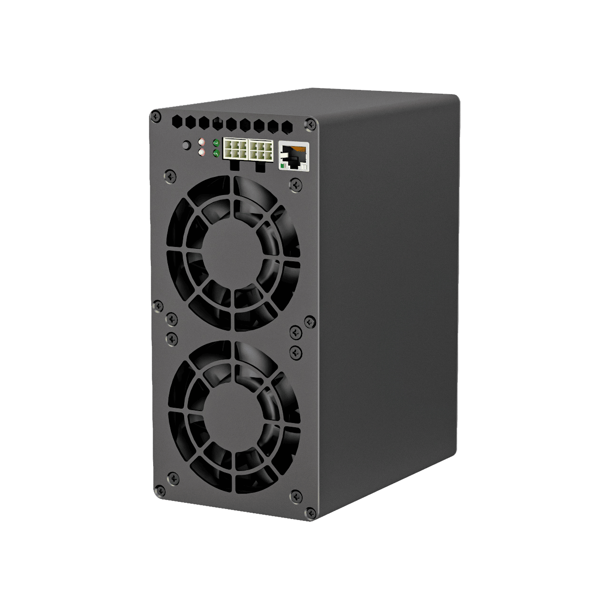
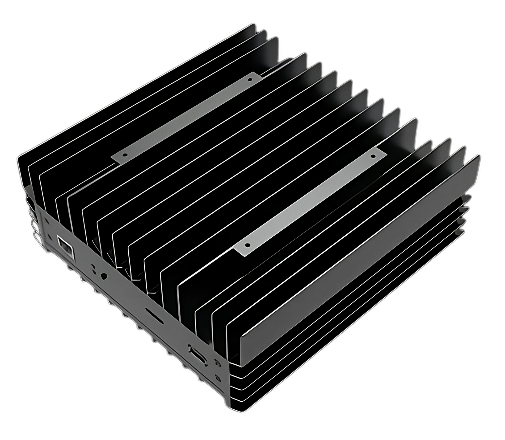
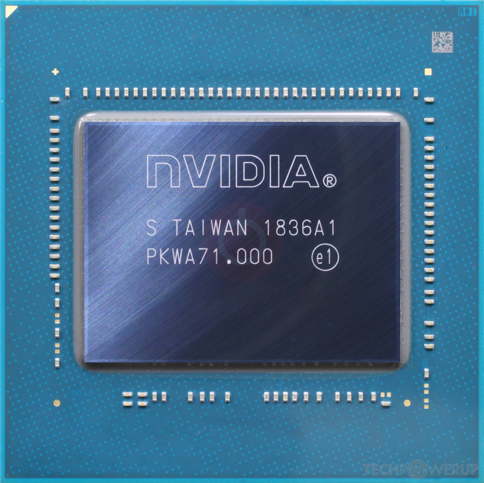
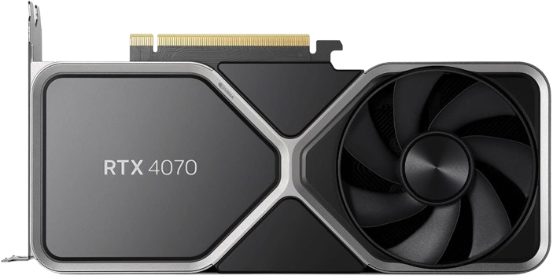

<pre align="center"><h1>Crypto Project</h1></pre>

## <samp> Coins I'm earning with: </samp>

    
    
    
    
    

    
## <samp> Coins I use actively: </samp>

    
    
    
    

## <samp> Coins I'm holding: </samp>

    
    
    

## <samp> ASICS I use: </samp>

    

        
        
        
         
        Goldshell KA-BOX |
        Iceriver Ks0 Ultra |
        Bitaxe 1366 Ultra 
    

## <samp> GPUS I use (testing): </samp>

    

        
         
        Nvidia 2060 mobile
    

    

        
         
        Nvidia 4070 Founders edition
    

